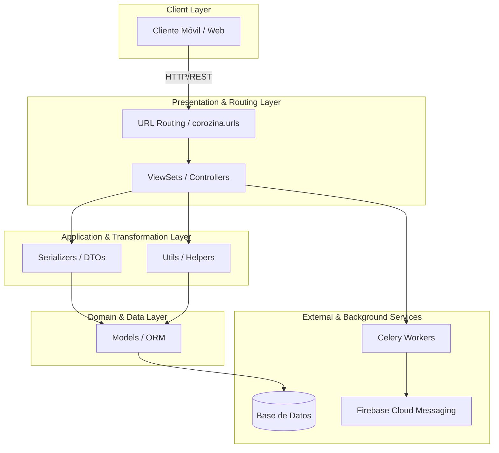
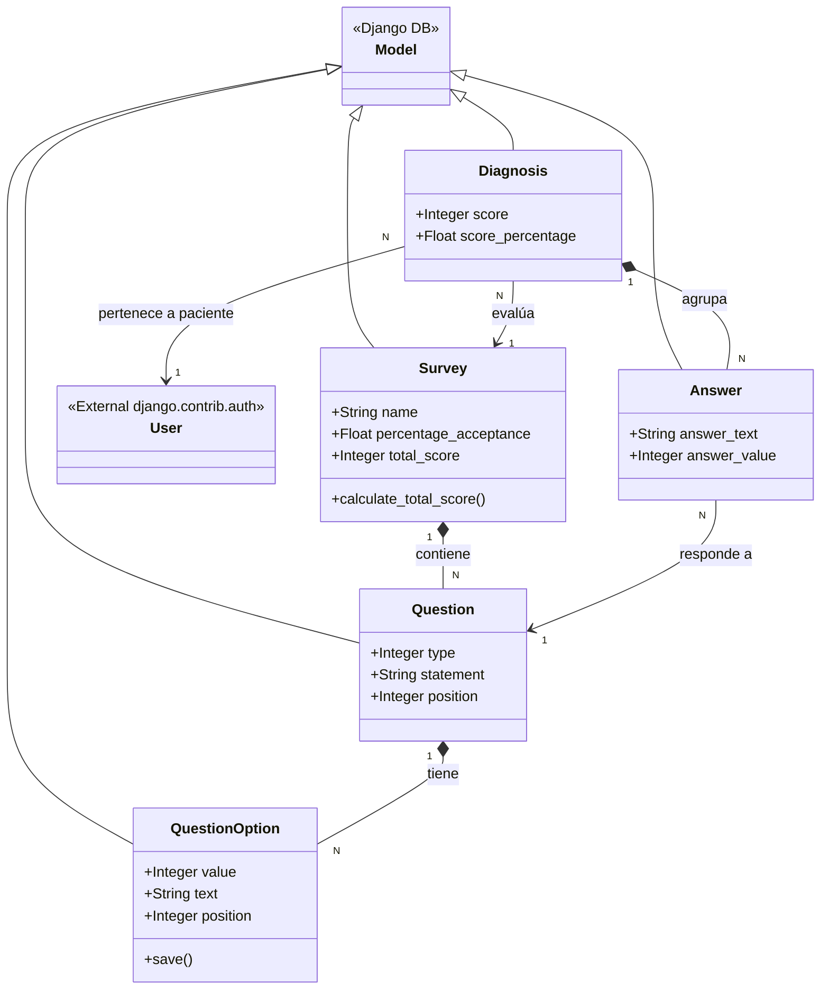

# Análisis de Arquitectura: Corozina Backend

## 1. Capas de la aplicación y sus dependencias

La aplicación sigue un patrón de arquitectura en capas común en aplicaciones Django Rest Framework (DRF), separando la lógica de enrutamiento, controladores, transformación de datos y persistencia.

* **Capa de Presentación / Enrutamiento (URLs y Viewsets):** Encargada de recibir las peticiones HTTP, verificar permisos y delegar la lógica.
* **Capa de Aplicación (Serializers y Utils):** Transforma la información JSON a objetos de Python, aplica reglas de validación complejas y lógica de negocio (ej. `calculate_percentage`).
* **Capa de Dominio / Datos (Models):** Define el esquema de la base de datos y abstrae la interacción con la persistencia.
* **Servicios Externos:** Manejo asíncrono y notificaciones.

---

## 2. Responsabilidad de cada paquete

1. **`corozina` (Core):** Es el paquete de configuración principal del proyecto. Define las configuraciones de Django (`settings.py`), el enrutamiento raíz, y la inicialización de ASGI/WSGI y Celery.
2. **`auth`:** Responsable de la autenticación y autorización personalizada de la aplicación. Maneja el inicio de sesión tradicional y mediante redes sociales (Facebook/Google) generando y despachando tokens JWT.
3. **`diagnosis`:** Es el dominio core de la aplicación (Core Business Domain). Su responsabilidad es gestionar las encuestas, preguntas, posibles opciones y almacenar/calcular el diagnóstico (diagnóstico médico, respuestas y score) de un paciente.
4. **`chat`:** Provee la capacidad de comunicación (mensajería) asíncrona entre doctores y pacientes mediante hilos (Threads) y Mensajes (Messages).
5. **`firebase`:** Encargado de la gestión de dispositivos y el envío de notificaciones Push (vía Firebase Cloud Messaging - FCM) a los usuarios.
6. **`userprofile`:** Extiende el modelo de usuario estándar de Django para agregar información de perfiles y definir los diferentes roles del sistema (Doctor o Paciente).

---

## 3. Responsabilidad de cada clase del paquete `diagnosis`

### Modelos (Models)
* **`Survey`**: Representa una encuesta médica. Contiene la metadata general y almacena el `total_score` posible.
* **`Question`**: Representa una pregunta individual asociada a un `Survey`. Define el tipo de pregunta (Sí/No, Selección Única, Selección Múltiple) y el enunciado.
* **`QuestionOption`**: Almacena las opciones de respuesta para una `Question` específica y su valor numérico (`value`) asociado que sumará al score total. Tiene la responsabilidad secundaria (mediante su método `save()`) de recalcular el score total de su `Survey` padre.
* **`Diagnosis`**: Es la instancia de la evaluación de un paciente. Relaciona a un Usuario (paciente) con un `Survey` específico y almacena el puntaje obtenido y su porcentaje.
* **`Answer`**: Representa una respuesta concreta proporcionada por un paciente en un `Diagnosis`. Se enlaza a una `Question` específica y guarda el texto y valor de lo contestado.

### ViewSets (Controladores)
* **`SurveyViewSet`**: Expone las operaciones CRUD sobre las encuestas médicas.
* **`QuestionViewSet`**: Permite la gestión de preguntas inyectando el contexto de creación necesario para anidamiento.
* **`QuestionOptionViewSet`**: Permite gestionar las opciones de cada pregunta de forma independiente.
* **`DiagnosisViewset`**: Maneja la recepción de nuevos diagnósticos de pacientes, utiliza distintos serializadores dependiendo de la acción (creación vs visualización) y sobrescribe `finalize_response` para desencadenar el cálculo final del puntaje de diagnóstico tras la creación.

### Serializers (Capa de Aplicación y Validación)
* **`QuestionOptionSerializer`**, **`QuestionSerializer`**, **`SurveySerializer`**: Se encargan de validar, serializar y guardar de forma anidada toda la jerarquía (Encuesta -> Preguntas -> Opciones) garantizando la integridad referencial.
* **`AnswerSerializer`**: Valida que la respuesta del paciente coincida estrictamente con el texto de las opciones predefinidas para la pregunta en cuestión.
* **`DiagnosisSerializer`**: Gestiona el almacenamiento complejo, iterando las respuestas enviadas, asignándoles su peso/valor correspondiente basado en la pregunta y asociándolas al diagnóstico.
* **`DiagnosisScoredSerializer`**: Serializador de solo lectura que expone los resultados (score y porcentaje) y decide si hay alerta de enfermedad (`disease_warning`).

### Utilidades y Campos (Utils & Fields)
* **`MultiTypeResponseField`**: Campo de DRF personalizado capaz de homogeneizar diferentes tipos de datos (str, int, bool) recibidos como respuestas a texto estandarizado.
* **`calculate_percentage`**: Función de utilidad que contiene lógica de negocio crítica. Suma los valores de las respuestas de un diagnóstico y calcula su porcentaje respecto al máximo posible de la encuesta, guardando el resultado.

---

## 4. Diagrama de Clases del paquete `diagnosis`

A continuación se representa la jerarquía de modelos, herencia y agregaciones principales del paquete `diagnosis`.

---

## 5. Tres riesgos de la arquitectura actual y propuestas de mejora

### Riesgo 1: Seguridad en la Autenticación Social (Seguridad)
**Descripción:** En `auth/authentication.py`, el `CustomAuth` backend recibe un `HTTP_SOCIAL_LOGIN_TOKEN` desde el cliente y, si no encuentra al usuario, **lo crea automáticamente y le genera una contraseña aleatoria**, asumiendo que el token es válido sin verificarlo remotamente (está marcado con el comentario `# TODO: validate if social token is valid in network social`). Un atacante podría falsificar un token e iniciar sesión como cualquier usuario enviando cualquier cadena. Adicionalmente, las claves de cifrado JWT como el SECRET_KEY se encuentran expuestas directamente en el código de configuración local de DRF (`corozina/drfconfig/main.py`).
**Mejora:** Integrar la validación backend a servidor usando las APIs oficiales de Facebook/Google para validar que el token enviado realmente fue provisto a la aplicación legítimamente y pertenece a ese usuario. Para los secretos, eliminar todas las credenciales explícitas en el código y abstraerlas al uso estricto de variables de entorno (`.env`).

### Riesgo 2: Mezcla de Responsabilidades (Side-Effects) en Modelos (Mantenibilidad)
**Descripción:** La lógica de negocio está acoplada dentro del ciclo de vida de los modelos de base de datos. Por ejemplo, al invocar `QuestionOption.save()`, éste invoca `calculate_total_score()` del Survey, el cual dispara transacciones a la base de datos por debajo. Esto dificulta las pruebas unitarias y causaría que operaciones masivas (como `bulk_update` o `bulk_create` que no disparan los hooks `save()`) dejen la aplicación en estados matemáticamente inconsistentes sin registrar error.
**Mejora:** Introducir el patrón **Service Layer** (Capa de Servicios). Extraer la lógica de cálculo y asignación de score fuera del ORM (`models.py`) y moverla a servicios de negocio, por ejemplo en un `diagnosis/services.py`. Las tareas de actualización complejas deben ser llamadas explícitamente desde estos servicios (envueltas bajo `transaction.atomic()`).

### Riesgo 3: Configuración predeterminada de base de datos y procesamiento síncrono (Escalabilidad)
**Descripción:** El archivo principal `corozina/settings.py` (e incluso los de ejemplo) deja configurada a `sqlite3` como la base de datos. SQLite aplica bloqueos a nivel de base de datos completa cuando existen procesos de escritura. Aunque el sistema posee configuraciones orientadas a background jobs (Redis, Celery, y dependencias como psycopg2 instaladas), la carga del procesamiento síncrono pesado se ejecuta en el main thread de la petición (ejemplo: llamar a la función `calculate_percentage` en el momento de retornar la respuesta en el Viewset o re-calcular la encuesta). Con muchos pacientes en concurrencia el backend se colapsará rápidamente.
**Mejora:** Eliminar completamente los settings apuntando a sqlite3, en su lugar configurar fuertemente el engine a Postgres (`django.db.backends.postgresql_psycopg2`) y agregar un PgBouncer si hay una demanda de conexiones muy alta. Además, convertir los procesos lentos de consolidación a Tasks asíncronas vía los workers configurados de Celery (`@shared_task`).

---

## 6. Implicaciones de migrar a Python 3.12 y Django 5.x y primer paso a seguir

**Implicaciones del salto tecnológico:**
* **Grandes Deprecaciones en Django:** El proyecto está en Django 3.x. Funciones obsoletas como `django.utils.translation.ugettext_lazy` (usada en `corozina/apps.py` y `auth/serializers.py`) ya no existen en Django 4.x/5.x y generarán un quiebre crítico; deben reemplazarse por `gettext_lazy`.
* **Soporte de Librerías de Terceros:** Módulos críticos como `djangorestframework` (3.11.0), `celery` (4.4.2), o `djangorestframework-simplejwt` necesitarán actualizarse a versiones compatibles con las firmas de clases de Django 5 y los internals actualizados de Python 3.12. Requerirán actualizaciones *Major* (versiones donde pueden romper compatibilidad hacia atrás).
* **Mejoras Asíncronas (ASGI):** Como ventaja, Django 5.x y Python 3.12 ofrecen un excelente soporte nativo asíncrono para Views y el ORM. Esto puede transformar la velocidad y eficiencia de operaciones de I/O de la aplicación (como los hilos de `chat` en tiempo real o integraciones con el API externa de notificaciones de FCM).

**¿Qué haría primero?**
El **primer e innegociable paso** es rehabilitar, ampliar y correr la **suite de pruebas automatizadas**. En la actualidad, el archivo `diagnosis/tests/test_views.py` contiene una advertencia explícita: *`"Test have been disabled needs new configurations and checks to pass..."`*.
1. Antes de siquiera alterar una línea del Framework o Python, las pruebas actuales deben arreglarse, habilitarse y agregar integración continua (CI) para obtener un porcentaje alto de Cobertura de Código. Esto proporcionará la "red de seguridad" que avise de las fallas tras la actualización.
2. Luego de asegurar las pruebas, la migración se ejecuta en peldaños conservadores: actualizar primero todo a la versión *LTS* de **Django 3.2**, arreglar las advertencias de deprecación reportadas en el build, saltar a Python 3.10/3.11, subir a **Django 4.2 LTS** (corrigiendo imports removidos), y, una vez estabilizado, dar el paso definitivo a **Python 3.12** y **Django 5.x**.
