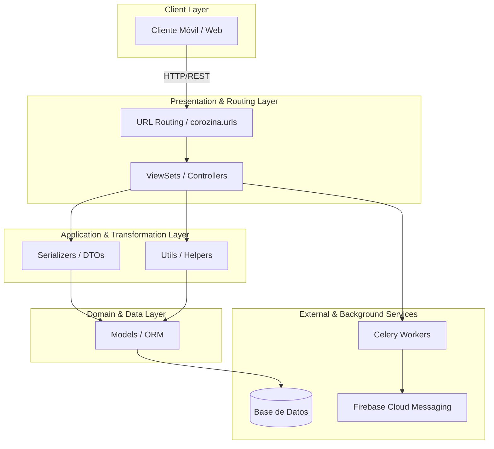
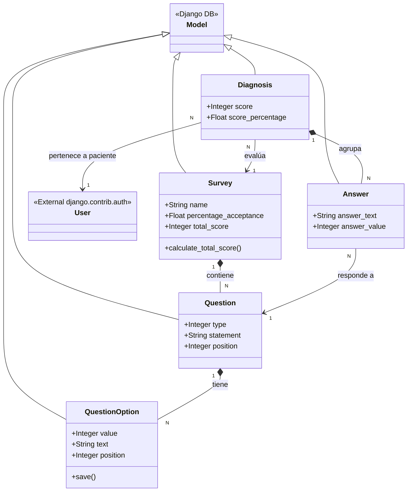

# Análisis de Arquitectura: Corozina Backend

## 1. Capas de la aplicación y sus dependencias

La aplicación sigue un patrón de arquitectura en capas común en aplicaciones Django REST Framework (DRF), separando la lógica de enrutamiento, controladores, transformación de datos y persistencia.

* **Capa de Presentación / Enrutamiento (URLs y Viewsets):** Encargada de recibir las peticiones HTTP, verificar permisos y delegar la lógica.
* **Capa de Aplicación (Serializers y Utils):** Transforma la información JSON a objetos de Python, aplica reglas de validación complejas y lógica de negocio (ej. `calculate_percentage`).
* **Capa de Dominio / Datos (Models):** Define el esquema de la base de datos y abstrae la interacción con la persistencia.
* **Servicios Externos:** Manejo asíncrono y notificaciones.

---

## 2. Responsabilidad de cada paquete

1. **`corozina` (Core):** Es el paquete de configuración principal del proyecto. Define las configuraciones de Django (`settings.py`), el enrutamiento raíz, y la inicialización de ASGI/WSGI y Celery.
2. **`auth`:** Responsable de la autenticación y autorización personalizada de la aplicación. Maneja el inicio de sesión tradicional y mediante redes sociales (Facebook/Google) generando y despachando tokens JWT.
3. **`diagnosis`:** Es el dominio core de la aplicación (Core Business Domain). Su responsabilidad es gestionar las encuestas, preguntas, posibles opciones y almacenar/calcular el diagnóstico (diagnóstico médico, respuestas y score).
4. **`chat`:** Provee la capacidad de comunicación (mensajería) asíncrona entre doctores y pacientes mediante hilos (Threads) y Mensajes (Messages).
5. **`firebase`:** Encargado de la gestión de dispositivos y el envío de notificaciones Push (vía Firebase Cloud Messaging - FCM).
6. **`userprofile`:** Extiende el modelo de usuario estándar de Django para agregar información de perfiles y definir los diferentes roles del sistema (Doctor o Paciente).

---

## 3. Responsabilidad de cada clase del paquete `diagnosis`

### Modelos (Models)

* **`Survey`**: Representa una encuesta médica. Contiene la metadata general y almacena el `total_score` posible.
* **`Question`**: Representa una pregunta individual asociada a un `Survey`. Define el tipo de pregunta (Sí/No, Selección Única, Selección Múltiple) y el enunciado.
* **`QuestionOption`**: Almacena las opciones de respuesta para una `Question` específica y su valor numérico (`value`) asociado que sumará al score total. Tiene la responsabilidad secundaria (mediante su método `save()`) de recalcular el score total de su `Survey` padre.
* **`Diagnosis`**: Es la instancia de la evaluación de un paciente. Relaciona a un Usuario (paciente) con un `Survey` específico y almacena el puntaje obtenido y su porcentaje.
* **`Answer`**: Representa una respuesta concreta proporcionada por un paciente en un `Diagnosis`. Se enlaza a una `Question` específica y guarda el texto y valor de lo contestado.

### ViewSets (Controladores)

* **`SurveyViewSet`**: Expone las operaciones CRUD sobre las encuestas.
* **`QuestionViewSet`**: Permite la gestión de preguntas inyectando el contexto de creación necesario para anidamiento.
* **`QuestionOptionViewSet`**: Permite gestionar las opciones de cada pregunta de forma independiente.
* **`DiagnosisViewset`**: Maneja la recepción de nuevos diagnósticos de pacientes, utiliza distintos serializadores dependiendo de la acción (creación vs visualización) y sobrescribe `finalize_response` para desencadenar el cálculo final del puntaje de diagnóstico tras la creación.

### Serializers (Capa de Aplicación y Validación)

* **`QuestionOptionSerializer`**, **`QuestionSerializer`**, **`SurveySerializer`**: Se encargan de validar, serializar y guardar de forma anidada toda la jerarquía (Encuesta -> Preguntas -> Opciones), garantizando la integridad referencial.
* **`AnswerSerializer`**: Valida que la respuesta del paciente coincida estrictamente con el texto de las opciones predefinidas para la pregunta.
* **`DiagnosisSerializer`**: Gestiona el almacenamiento complejo, iterando las respuestas enviadas, asignándoles su peso/valor correspondiente basado en la pregunta y asociándolas al diagnóstico.
* **`DiagnosisScoredSerializer`**: Serializador de solo lectura que expone los resultados (score y porcentaje) y decide si hay alerta de enfermedad (`disease_warning`).

### Utilidades y Campos (Utils & Fields)

* **`MultiTypeResponseField`**: Campo de DRF personalizado capaz de homogeneizar diferentes tipos de datos (str, int, bool) recibidos como respuestas a texto estandarizado.
* **`calculate_percentage`**: Función de utilidad que suma los valores de las respuestas de un diagnóstico, calcula el porcentaje respecto al máximo posible de la encuesta y guarda el resultado.

---

## 4. Diagrama de Clases del paquete `diagnosis`

A continuación se representan las relaciones, dependencias y agregaciones principales del paquete `diagnosis`.

---

## 5. Tres riesgos de la arquitectura actual y propuestas de mejora

### Riesgo 1: Seguridad en la Autenticación Social (Seguridad)

**Descripción:** En `auth/authentication.py`, el backend `CustomAuth` recibe un `HTTP_SOCIAL_LOGIN_TOKEN` desde el cliente y, si no encuentra al usuario, lo crea automáticamente y le genera una contraseña aleatoria, asumiendo que el token es válido sin verificarlo remotamente (marcado con `# TODO: validate if social token is valid in network social`). Un atacante podría falsificar un token e iniciar sesión con una identidad ajena. Además, `corozina/drfconfig/main.py` contiene una clave JWT codificada directamente.

**Mejora:** Validar el token en el servidor con las APIs oficiales de Facebook/Google y comprobar que pertenece a la identidad declarada. Eliminar la clave JWT del código y cargarla de una variable de entorno o un gestor de secretos.

### Riesgo 2: Mezcla de responsabilidades y efectos secundarios en modelos (Mantenibilidad)

**Descripción:** `QuestionOption.save()` recalcula el score del `Survey` y escribe en la base de datos. Esto acopla reglas de negocio al ciclo de vida del ORM y puede dejar resultados inconsistentes cuando se usan operaciones masivas que no invocan `save()`.

**Mejora:** Extraer la lógica de cálculo a un servicio de dominio, por ejemplo `diagnosis/services.py`, y ejecutar las operaciones de escritura de forma explícita dentro de `transaction.atomic()`.

### Riesgo 3: Base de datos y procesamiento síncrono (Escalabilidad)

**Descripción:** La configuración local usa SQLite, que serializa escrituras; además, el cálculo de porcentaje se ejecuta síncronamente durante la respuesta del endpoint. Con carga concurrente, ambas decisiones pueden convertirse en cuellos de botella.

**Mejora:** Usar PostgreSQL en producción y pruebas de integración, configurar un pool de conexiones si la carga lo requiere y mover tareas costosas a workers asíncronos (por ejemplo, Celery), devolviendo al cliente un estado de procesamiento cuando el cálculo no deba bloquear la respuesta.

---

## 6. Implicaciones de migrar a Python 3.12 y Django 5.x y primer paso

### Implicaciones

* **Deprecaciones de Django:** APIs como `ugettext_lazy` fueron eliminadas y deben reemplazarse por `gettext_lazy`; también hay que revisar cambios en autenticación y configuración.
* **Compatibilidad de terceros:** DRF, Celery y `djangorestframework-simplejwt` requieren versiones compatibles con Django 5 y Python 3.12; los saltos mayores pueden cambiar firmas y comportamiento.
* **Runtime y concurrencia:** ASGI y el soporte asíncrono pueden ayudar en operaciones de I/O, pero no convierten automáticamente código ORM síncrono en asíncrono.

### Primer paso

Antes de actualizar, rehabilitar y ejecutar la suite de pruebas automatizadas. El archivo `diagnosis/tests/test_views.py` contiene una advertencia de pruebas deshabilitadas, por lo que primero se debe recuperar esa red de seguridad. Después conviene migrar en etapas —resolver deprecaciones, actualizar dependencias y probar cada salto—, documentando resultados entre versiones, en lugar de saltar directamente al destino sin pruebas.
